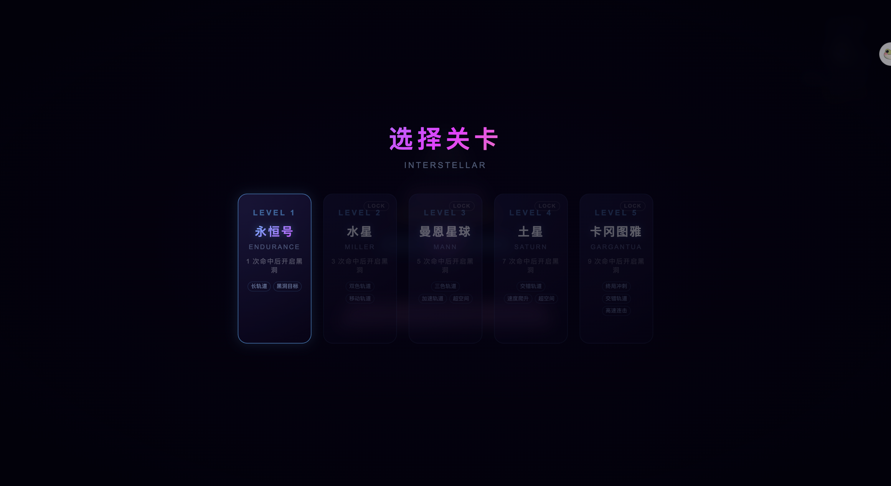
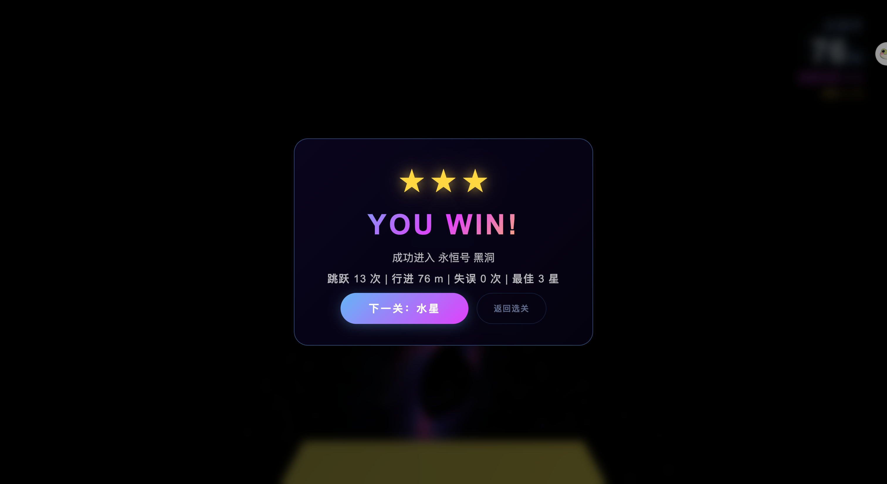
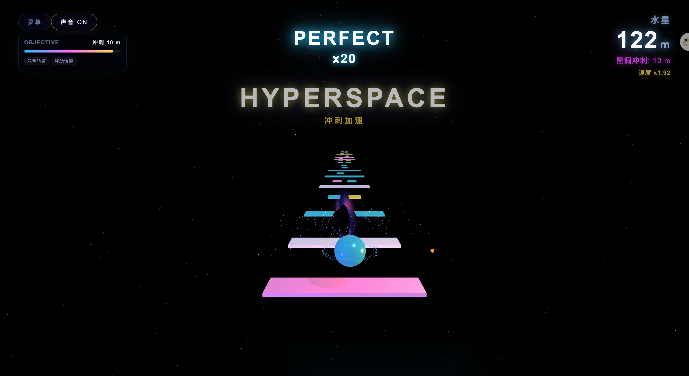

# 星际弹跳跑酷

一个基于 Three.js 的 3D 星际弹跳跑酷小游戏。玩家控制一颗能量球在太空轨道上持续弹跳前进，匹配正确颜色、躲避错误轨道、保持连击，并在黑洞冲刺阶段完成最后挑战。

## 游戏截图







## 玩法简介

能量球会不断向前弹跳，你需要控制它落到正确的轨道上。

- 轨道颜色匹配时会继续前进并增加连击。
- 落错颜色或掉出轨道会失败。
- 达成当前关卡的命中目标后，会进入黑洞冲刺阶段。
- 黑洞冲刺阶段速度更快、轨道变化更多，需要坚持到最后。

每一关都会在前一关基础上增加新机制，从基础长轨道逐步加入移动轨道、三色轨道、加速轨道、交错轨道和高速终局冲刺。

## 操作方式

| 操作 | 功能 |
| --- | --- |
| 鼠标移动 | 控制能量球横向位置 |
| `A / D` | 左右微调 |
| `← / →` | 左右微调 |
| 触屏拖动 | 移动端控制 |
| 声音按钮 | 开关背景音乐和音效 |

## 关卡设计

| 关卡 | 命中目标 | 新机制 |
| --- | ---: | --- |
| 永恒号 | 1 | 长轨道、黑洞目标 |
| 水星 | 3 | 双色轨道、移动轨道 |
| 曼恩星球 | 5 | 三色轨道、加速轨道、超空间连击 |
| 土星 | 7 | 交错轨道、速度爬升 |
| 卡冈图雅 | 9 | 终局冲刺、交错轨道、高速连击 |

## 特色机制

- **程序化轨道**：不同关卡会生成不同类型的轨道组合。
- **连击反馈**：连续命中会触发 `PERFECT`、倍率和超空间效果。
- **黑洞冲刺**：命中目标后进入高压终局，速度和轨道变化都会提升。
- **音效系统**：背景音乐、命中、加速、失败和胜利用 Web Audio API 合成。
- **本地进度**：关卡解锁和最佳成绩会保存在浏览器本地。

## 本地运行

```bash
npm install
npm run dev
```

打开终端显示的本地地址即可开始游戏。

## 构建

```bash
npm run build
```

## 技术栈

- Three.js
- Vite
- Web Audio API
- LocalStorage

## 项目说明

这是一个可试玩的 3D Web 游戏原型，重点展示程序化关卡、实时 3D 视觉、即时反馈、关卡递进和黑洞终局冲刺体验。
